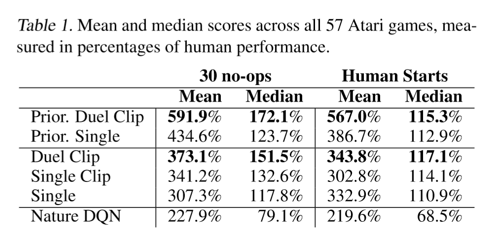
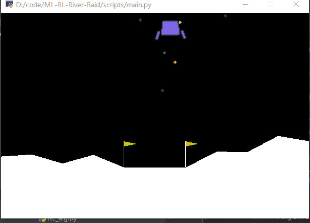

# Machine Leaning Project: An Agent for LunarLander-v2 Using Dueling Deep Q Network

PB17121687 虞佳焕 100% 贡献

**Notice:** 数学公式在 Typora 中正常显示，需开启 `Markdown 扩展语法` 中的 `内联公式` （重新启动 Typora 生效）。

**Notice:** 导入约束中需要添加 `torch.empty`, `torch.tensor`

## 基本设计

### 实验要求

实验要求设计并训练一个 `LunarLander-v2` 游戏的 agent.

阅读文档可知，这是一个要求操纵一个飞行器着陆在指定位置的游戏，游戏环境给出一个 8-bit 的向量代表飞行器的当前状态，分别是

- x 坐标
- y 坐标
- x 方向速度
- y 方向速度
- 倾斜角度
- 角速度
- 左起落架是否着陆 (`0` 代表未着陆，`1` 代表着陆)
- 右起落架是否着陆

Agent 需要根据这个 8-bit 的向量给出一个 action 作为回应，可以的取值为

- `0`: 无操作
- `1`: 左向发动机点火
- `2`: 主发动机点火
- `3`: 右向发动机点火

做出 action 之后，游戏环境会给出 reward:

- `-0.3`: 发动机点火一次
- `10`: 一个起落架接触地面
- `-100`: 坠毁
- `100`: 安全着陆
- `200`: 在指定位置着陆

可知这是一个典型的可以用 Q-Learning 解决的问题，只需寻找到合适的 `Q` 函数计算方法。

### 模型结构

由于 8-bit 的状态向量取值是浮点数，因而无法计算 `Q` 表，而手动设计 `Q` 函数也难以做到。

实验要求中推荐了 Deep Q Learning with Experience Reply 的方法。

其基本思想是训练一个神经网络(DQN)来输出每个 `action` 对应的 `Q` 值，即对于状态向量 `s` 和每一个动作 `a`, 输出

$$Q(s,a;\theta)$$

其中 $\theta$ 是神经网络参数。

为了改进算法，我找到了两篇论文。

1. [Deep Reinforcement Learning with Double Q-learning](https://arxiv.org/abs/1509.06461)

    这篇论文主要解决的是 $\max_a \overline{Q}(s_{t+1},a;\overline{\theta})$ 过估计的问题。

    Double DQN 的算法为

    

    和 DQN 的主要区别在于，DQN 中

    $$y_j=r_j+\gamma \max_a \overline{Q}(s_{t+1},a;\overline{\theta})$$

    而 $\overline{Q}$ 的非准确性会带来 $\max_a \overline{Q}(s_{t+1},a;\overline{\theta})$ 的过估计。

    为了解决这个问题，$y_j$ 的计算方法被替换为

    $$y_j=r_j+\gamma \overline{Q}(s_{t+1},\max_a Q(s_{t+1},a;\theta);\overline{\theta})$$

    引入了另一个网络来决定选择哪个 `a`, 以部分打消过估计的劣势。

    论文中也展现了此算法带来的改进：

    

2. [Dueling Network Architectures for Deep Reinforcement Learning](https://arxiv.org/abs/1511.06581)

    Dueling DQN 的主要思想是，计算 `Q` 值时，需要分成两部分计算：**环境观察 `V(s)`** 和 **动作对于环境的改变 `V(s,a)`**，即

    $$Q(s,a;\theta,\alpha,\beta)=V(s;\theta,\alpha) + \left( A(s,a;\theta,\beta) -\cfrac{1}{|A|} \sum_a A(s,a;\theta,\beta) \right)$$

    网络结构如下：

    

    论文中给出的实验结果如下

    

    这个想法很简单但却提升巨大。

综合这两种改进，我设计的神经网络结构为

|                   **Input 8-bit**                   |
| :-------------------------------------------------: |
|                      FC 8->64                       |
|                        Relu                         |
|                      FC 64->64                      |
|                        Relu                         |
|          FC(V) 64->32   \|   FC(A) 64->32           |
|          Relu(V)        \|        Relu(A)           |
|           FC(V) 32->1   \|   FC(A) 32->4            |
| **Output 4bit** （根据 Dueling DQN 的公式进行计算） |

最后从 4-bit 的 `Q` 值（每个 `a` 对应一个分量）中选取一个最大的分量，对应的 `action` 作为输出。

## 实现

我使用 PyTorch 的线性运算库（未调用任何高级 API，使用 PyTorch 是因为其能比较好地使用 GPU 资源）来完成神经网络中的正向传播和反向传播。

项目的核心代码是 4 个类：`FullConnection`, `Relu`, `DuelingDoubleDQN` 和 `LunarLanderAgent`.

### FullConnection

此类负责实现全连接层，主要为前向传播函数 `forward` 和反向传播函数 `backward`.

全连接层的前向传播是一个简单的线性代数计算：

$$out=weight\times in+bias$$

只需使用简单的矩阵乘法即可实现，此处不再赘述。

反向传播公式为

$$\cfrac{\partial\ L}{\partial\ weight}=in\times\cfrac{\partial\ L}{\partial\ out}$$
$$\cfrac{\partial\ L}{\partial\ bias}=\cfrac{\partial\ L}{\partial\ out}$$
$$\cfrac{\partial\ L}{\partial\ in}=weight\times\cfrac{\partial\ L}{\partial\ out}$$

同样可以用简单的矩阵乘法实现。

代码见 `src\alg\PB17121687\lunar_lander\full_connection.py`

### Relu

Relu 起到给神经网络引入非线性的作用，实现比较简单：

只要每次正向传播时记录一下 `>0` 的元素个数，正向时把 `<0` 的元素置 `0`, 反向传播时，对于之前正向传播时记录的 `<0` 位置的梯度置 `0`.

代码见 `src\alg\PB17121687\lunar_lander\relu.py`

### DuelingDoubleDQN

此类实现整个神经网络，主要工作就是按照顺序分别计算每一层的正向传播和反向传播结果。

代码见 `src\alg\PB17121687\lunar_lander\model.py`

### LunarLanderAgent

此类实现 Agent 的所有功能，主要包括训练和使用。

训练功能的实现完全参照以上使用的算法，使用功能则是输入环境，输出神经网络结果的 argmax.

代码见 `src\alg\PB17121687\lunar_lander\agent.py`

## 训练与测试

由于本神经网络规模较小，参数量仅有不到 $10^4$ 数量级，同时训练样本也能很好地通过游戏环境生成，因而我只采用了最简单的**梯度下降**算法对神经网络进行训练，结果表明这种简单算法已经有很好的效果。

### Xaiver 初始化

数据的初始化对于模型的收敛速度和最终效果非常重要，一个坏的初始化可能会导致梯度消失、陷入局部最优等种种问题。

一个更好的初始化方法被称为 Xaiver 初始化，其目的是**尽量使梯度能更好地反向传播，缓解梯度消失问题**。

若一层网络（卷积层或全连接层）的输入数据数量为 $d_{in}$, 输出数据为 $d_{out}$, Xaiver 初始化目的是**反向传播的输入和输出方差一致**，经过一些数学推导（参照 Xaiver 初始化的提出论文），可得初始化参数可取均匀分布

$$W\sim U[-\cfrac{\sqrt{6}}{\sqrt{d_{in}+d_{out}}},\cfrac{\sqrt{6}}{\sqrt{d_{in}+d_{out}}}]$$

### 训练过程

训练的一些参数设置如下：

- 学习率 `learning_rate=0.0005`
- 最大 episode `M=2000` 
- Reply memory 大小 `reply_memory_size=infty`
- 每次更新神经网络时使用的 `mini_batch_size=64`
- 训练 agent 时选取 action 的随即比例 `epsilon`, 初始值为 `0.995`, 每经过一个 eposide 乘以 `0.99` 的衰减比例，直到衰减为 `0.01`
- $\tau=0.001$
- $\gamma=0.99$

训练时记录每轮游戏的得分，最终绘制的图片如下：

可以看到最终得分稳定在 `250` 左右，在这时停止训练。

观察得分的分布可知，前 600 episode 时，agent 几乎没有完成过成功着陆，**这时的得分提升基本依靠减少燃料使用**，但在之后，agent 完成一次成功着陆后，得分上升了一个台阶，但仍然不稳定，600 episode 之后的训练过程就是强化这一次成功着陆的 exprience, **逐渐减少失败率**，最终达成几乎不失败的成果。

## 结果

如果无法显示 GIF 则打开 `pic/show.gif`.
